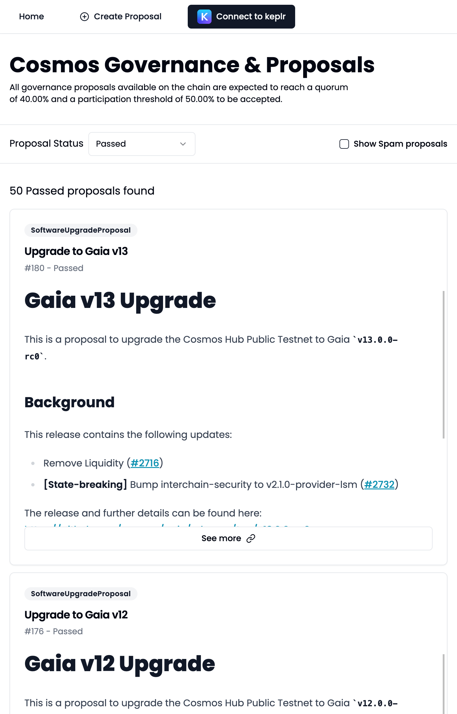
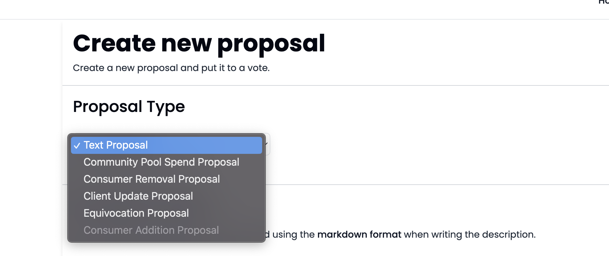

# Cosmos Gov
Cosmos Gov is a web interface built for Cosmos governance and is a submission to the [AEZ Boost Hackathon](https://dorahacks.io/hackathon/aez-boost/detail).

Using RPC, protobuf generation and environment variables instead of just using chain-registry, we are able to provide a voting interface that is both future-proof and can be easily extended to support chain specific proposal decoding, encoding and creation while supporting weighted voting, a rarely seen feature.


Special care has been given to support displaying proposal content fields as well as weighted and legacy votes.



*A listing of current proposals on the landing page*

## Features
This web interface:
- Allows connection using the desktop Keplr wallet
- Lists and parses all Governance proposals
- Allows Weighted voting on proposals
- Shows off an individual user's vote (with support for weigthed votes)
- Allows the creation of a TextProposal with customizable deposit with autonavigation to the broadcasted proposal
- Makes use of the [View Transition API](https://developer.mozilla.org/en-US/docs/Web/API/View_Transitions_API) just because


## Potential improvements
- Some proposals' description do not follow the conventional Markdown syntax, while some steps have been taken to work around this, rendering can be wonky at times
- SDK v0.47 protos are included but not used as Cosmos Hub has not yet upgraded at this time
- We're using a pretty naive implementation of a Spam proposal filter 
- Unknown proposals types will not cause the app to fail but show its content off as unknown. A more general way of importing generated protos in the registry should solve this.

## Getting Started
We expect a .env file in the env folder, you'll find a .env.example file outlining the required info

```bash
pnpm install

pnpm dev
```

Navigate to localhost:5173 

## Adding support for additional proposals

Any additional proposal type can be supported and its relevant proposal definition created by implementing the  ```ProposalDescriptor``` interface like so:

```ts
import { TextProposal } from '$lib/cosmos/transpile/cosmos/gov/v1beta1/gov';

interface ProposalDescriptor<T> {
	label: string;
	description: string;
	value: T;
	url: string;
	partial: (input: T) => T;
	encoder: (message: T) => BinaryWriter;
	disabled?: boolean;
}


const textProposalDescriptor: ProposalDescriptor<TextProposal> = {
	value: {
		title: '',
		description: ''
	},
	url: '/cosmos.gov.v1beta1.TextProposal',
	label: 'Text Proposal',
	description: 'Signal support for a change',
	partial: TextProposal.fromPartial,
	encoder: TextProposal.encode
};
```
By doing so, you're able to provide an helpful description of what the given proposal entails for the network.

These proposal descriptors then need to be added to the ```AVAILABLE_PROPOSALS_DESCRIPTORS``` like so:

```ts
export const AVAILABLE_PROPOSALS_DESCRIPTORS = [
	// Currently defined proposals
    /// ...,
	textProposalDescriptor,
] as const;
```

These proposal types will now be available for creation under the ```/new``` route:


*Relevant proposal types*


Relevant protobuf definitions can be generated by using [telescope](https://github.com/cosmology-tech/telescope)

## Demo transactions
- Text Proposal creation on Cosmos Hub testnet [explorer link](https://testnet.mintscan.io/cosmoshub-testnet/txs/A630067D2A005A3C82997D2CC0C34DC3CA31A6DE8117EFA5997D46F3A5FFD641) (hash (A630067D2A005A3C82997D2CC0C34DC3CA31A6DE8117EFA5997D46F3A5FFD641)


- Weighted vote on Osmosis [explorer link](https://www.mintscan.io/osmosis/transactions/886CD10973DE83F0BA2131F9070A2E7BB30F586320417C61265CA2B1871712B1) (hash (886CD10973DE83F0BA2131F9070A2E7BB30F586320417C61265CA2B1871712B1)
